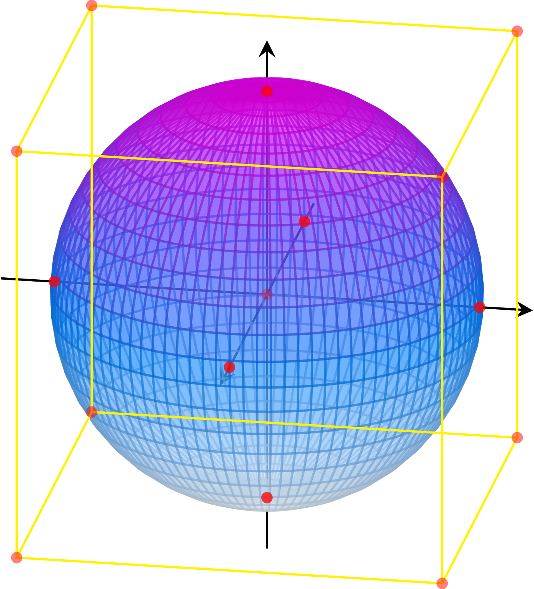

# 3D Modelling Convention

## Naming

| Object type        | Notation   | Whitespaces | Plural | Part of speech | Abbreviation | Char Mask  |
| :----------------- | :--------- | ----------- | :----- | :------------- | :----------- | :--------- |
| 3D Model           | PascalCase | No          | No     | Noun           | No           | [A-z][0-9] |
| 3D Model's objects | PascalCase | No          | No     | Noun           | No           | [A-z][0-9] |
| Material           | snake_case | No          | No     | Noun           | No           | [a-z][0-9] |
| Texture            | snake_case | No          | No     | Noun           | No           | [a-z][0-9] |

#### 1. Only English names are allowed

#### 2. Use meaningful names everywhere

#### 3. Do not transliteration. Exception: proper names

#### 4. Do not use caps

#### 5. Avoid using Abbreviations. Exceptions: abbreviations commonly used as names, such as Id, Xml, Ftp, Uri, Ar, Vr etc

#### 6. Name objects

It is not allowed to leave primitive names or other default names, such as:

- Cube
- Box
- Cylinder
- Cone
- Sphere
- и т. п.

Exception: the name of the object really corresponds to the object, i.e., if you have a box in your model, then it can be called Box.

#### 7. Do prefix material names with model name in `camel_case`

#### 8. Do name textures according to this scheme: `"model name"_"additional data"_"texture king"`. `"additional data"` may not be specified. `"model name"` must be in `snake_case`. `"texture kind"` sould have `_map` suffix

```bash
# Example texture naming for model named "Some.fbx":

# for albedo texture (basemap)
some_base_map.png

# for metallic map texture
some_metallic_map.png

# for normal map texture
some_normal_map.png

# for height map texture
some_height_map.png

# for emission map texture
some_emission_map.png

# for occlusion map texture
some_ao_map.png

# for height (deform) map texture
some_height_map.png
```

## Pivot

Place the pivot(origin) like this:

If the model needs to "connect" to something (for example, an object that the character will hold), the pivot should be the "connection point".

Otherwise, the pivot should be located on the bounding box (an imaginary box described around the model), preferably on its vertices or intersections with the coordinate axes.

Example:

Assuming that the model is a blue-violet surface and the bounding box is a yellow cube, the possible position of the pivot is indicated by red dots.

## Transform

For each object, the local scale must be `(1, 1, 1)`. If you need to change the scale, change the scale of the mesh itself.

## Dimensions

Keep an eye on the dimensions and angles in your model, especially if you're modeling something architectural. Remember that `1 unit = 1 meter`.

## General

#### 1. For each material there should be at least basemap texture

#### 2. Use UVs to keep textures as small as possible
