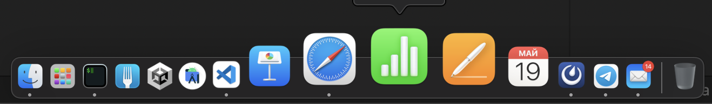

# Macos workflow guide

## Как добавить пустые ячейки между ярлыками в Dock'е Macos, чтобы он выглядел удобно и лаконично?

### 1. Для начала нужно выстроить порядок приложений и понять где между ними будет пробел для их отделения.



#### Как видно на данном скрине, то все, что касается кодинга - Unity, терминал, Fork, Android Studio, VS Code - будут отдельной секцией. Keynote, Safari, Numbers, Pages - другой и календарь, Mattermost, Telegram, Почта - третьей.

### 2. Далее, открываем Terminal и прописываем следующие команды: 

```bash

> defaults write com.apple.dock persistent-apps -array-add '{"tile-type"="spacer-tile";}'

> killall Dock
```

#### После выполнения данной команды у вас появится пустой значок в панели Dock. Его можно перемешать по ней, перетаскивая как обычные значки в Dock'е. Если нужно добавить разделителей, то можно повторить 1-ю команду еще несколько раз. Таким образом, рабочее пространство Dock'а можно довести до такого вида. 


