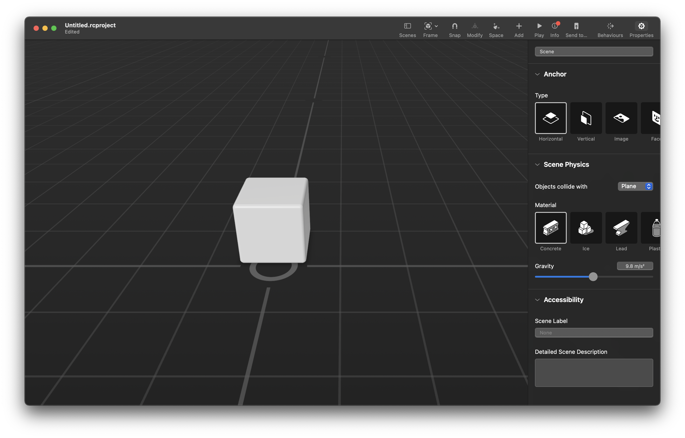
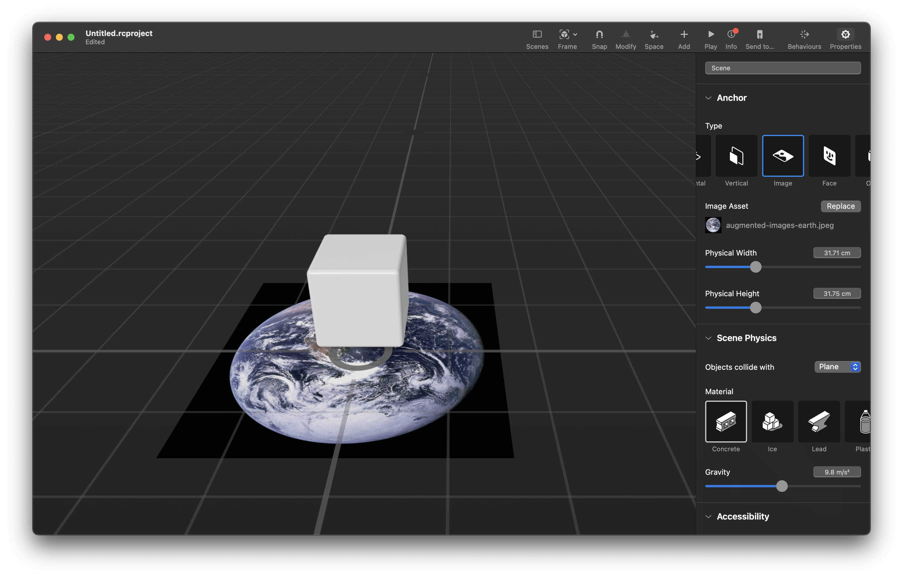
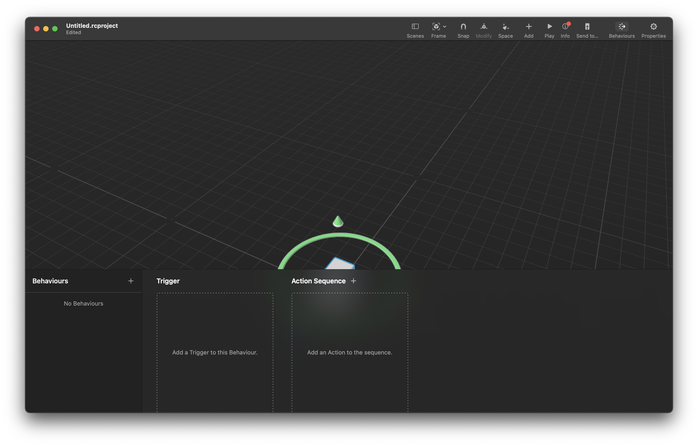
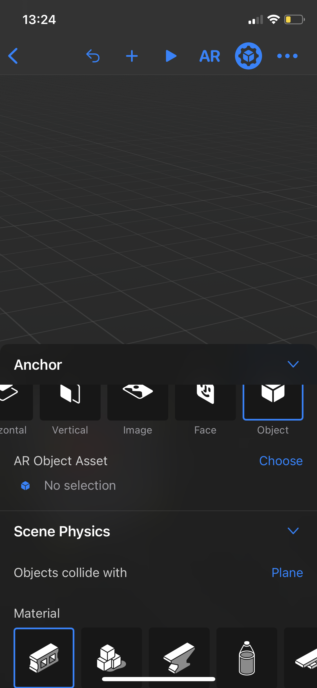
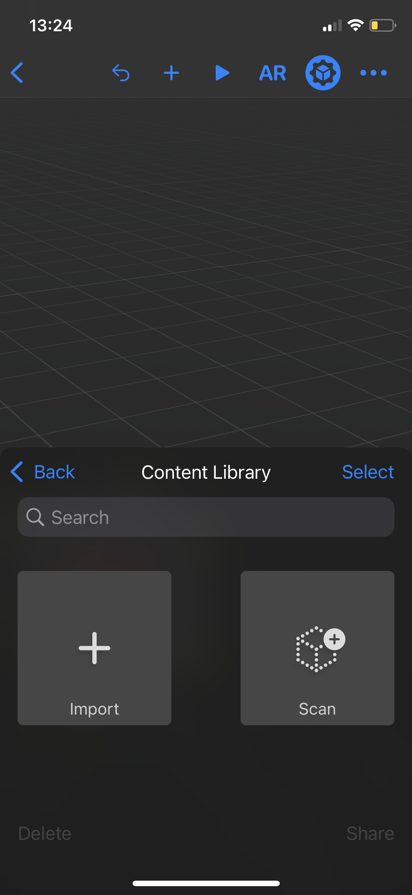
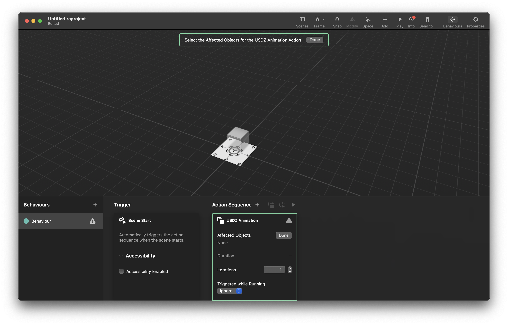
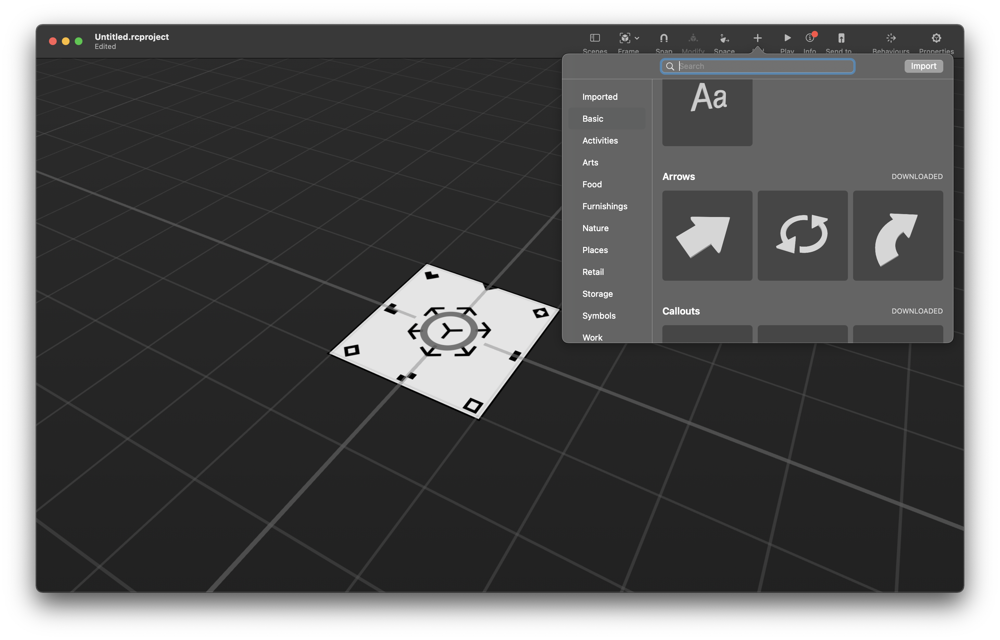
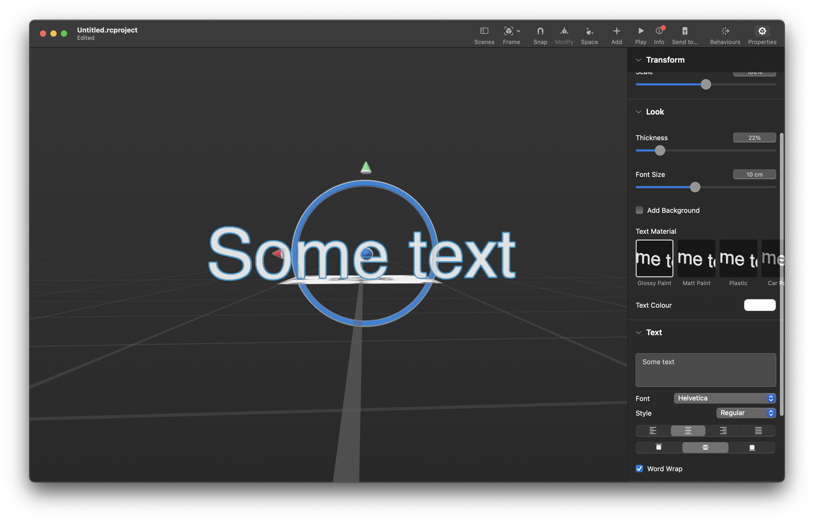
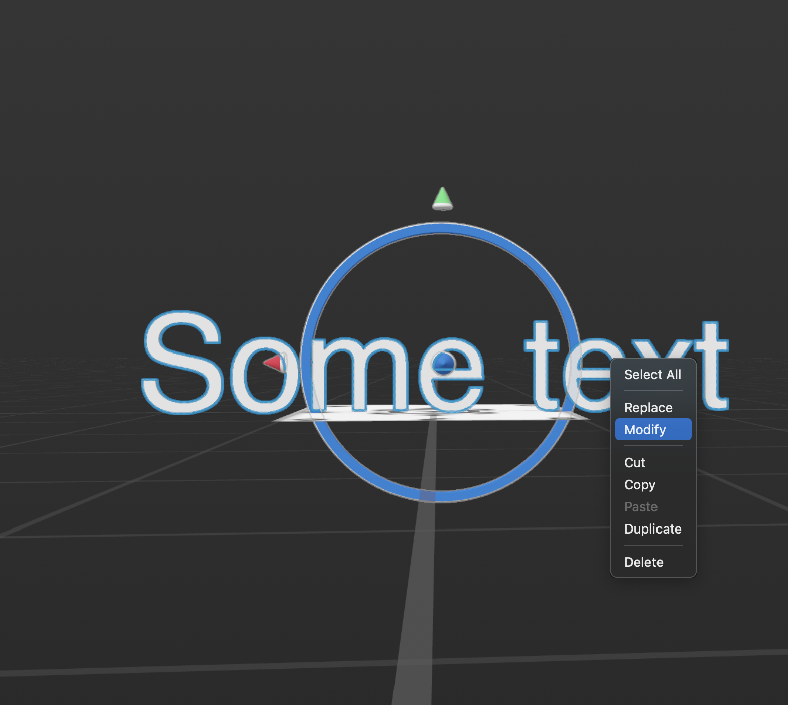
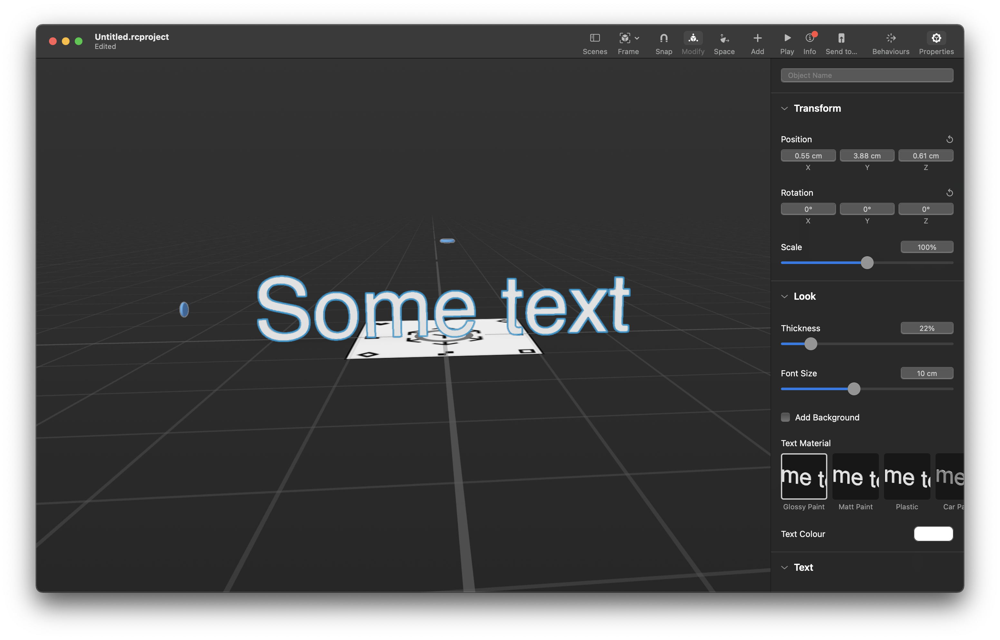

# Reality Composer workflow

## Anchor'ы

В reality composer контент привязывается к `Anchor`'у.

Acnhor'ы бывают 5 типов:

- горизонтальная плоскость
- вертикальная плоскость
- картинка
- лицо
- объект

Для того чтобы редактировать Anchor надо снять выделение со всех объектов (если оно есть) и открыть окно `Properties`, в котором можно выбрать тип `Anchor`'а.

### Image Anchor

`Image Anchor` требует задания картинки, которая будет использоваться в качестве метки и указать его физический размер.

### Object Acnhor

`Object Anchor` требует задания отсканированного объекта который в дальнейшим будет распознан.

Объект можно отсканировать с iOS-устройства.

Процесс сканирования заключается в фотографировании объекта по кругу и сверху. После того, как объект отсканирован следует проверить качество распознавания с ракурсов, которые предполагаются наиболее вероятными в production, и в случае неудовлетворительных результатов отсканировать объект заново

## Работа с контентном

### Импортирование 3d моделей

Reality Composer поддерживает `.obj` и `.usd(z)` файлы. `.obj`, в отличии от `.usd(z)` не поддерживает анимации.

### Размещение контента

В Reality Composer 3d модели можно передвигать (за стрелочки), вращать по осям (выбрать ось нажатием на стрелочку) и масштабировать (только пропорционально).

Так же можно: переключать пространство с глобального на локальное и включать/отключать snapping.

### Behaviours

Reality Composer позволяет добавлять интерактив к объектам (`Behaviour`'ы), который работает следующим образом: Определенное действие (`Action`) запускается на определенное событие (`Trigger`). Существуют уже готовые `Behaviour`'ы (пары `Trigger`-`Action`).

### Анимации

По умолчанию Reality Composer не запускает анимации. Анимацию можно запустить через `Behaviour`, используя `Action` USDZ Animation. Например, следущий `Behaviour` запустит анимацию выбранныъ объектов (Affected Objects) при запуске сцены.

### Библиотека контента

В Reality Composer существует библиотека готового контента, из которой объект можно добавить на сцену.

В окне `Properties` можно редактировать параметры объекта.

Так же можно изменять размер объекта (особенно актуально для текстов) через пункт `Modify` в контекстном меню

### Результат работы

Конечным результатом работы является `.reality`-файл, который должен быть экспортирован из проекта и может быть открыт при помощи [AR Quick Look](https://developer.apple.com/augmented-reality/quick-look/) как локально так и в браузере, или использован в `xcode`-проекте.
