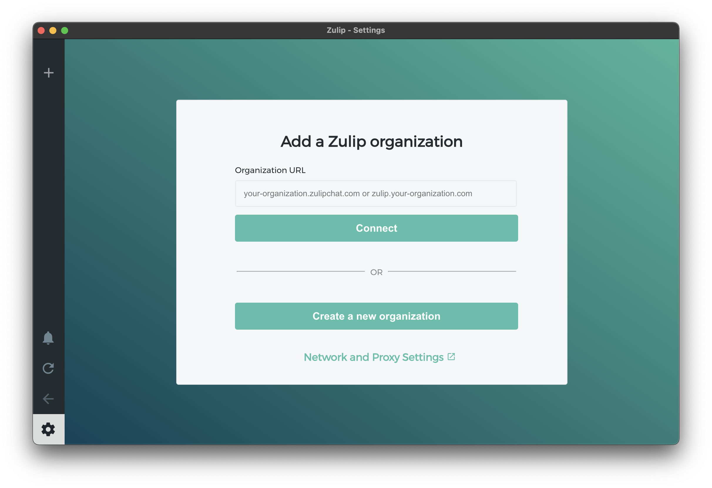

# Zulip installation

У Zulip есть веб-версия и официальные клиенты для всех платформ. Ниже приведены инструкции по установке клиента.

Если вы хотите пользоваться веб-версией, перейдите по URL, который вам сообщат.

#### 1. Установите Zulip

[Страница установки zulip на официальном сайте](https://zulip.com/apps/).

#### 2. Подключитесь к нашему серверу

В поле Organization URL введите URL, который вам сообщат и нажмите кнопку Connect.